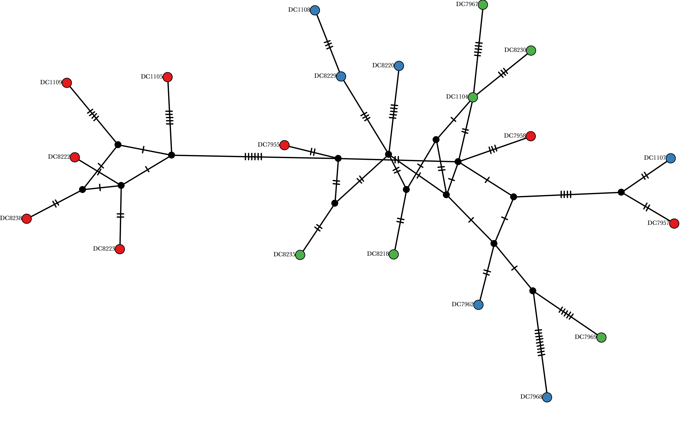

```{r, echo=FALSE}
knitr::opts_chunk$set(fig.width=12, fig.height=8,
                      echo=FALSE, warning=FALSE, message=FALSE)
```

```{r}
library(tidyverse)
library(ggtree)
library(treeio)
library(ape)
```


The mitochondrial haplotype network showed that every sample had a distinct haplotype, resulting in a highly reticulated network. This was visualised using PopArt (see below). 



As a complement to examining mitochondrial haplotype networks we also performed maximum likelihood tree inference on mitochondrial haplotypes using iq-tree. This is especially sensible for the host case since there were no shared haplotypes.

For the host we find that the red lineages almost form a monophyletic group (with the exception of DC7957) whereas the green and blue lineages are intermingled within several clades.

```{r}
mito_tree <- read.iqtree(file = "hpc/mito_mapping/AllSamplesPSPEMitoConsensusTrim.fasta.treefile")

sample_data <- read.delim("raw_data/samples.txt",stringsAsFactors = FALSE) %>% filter(SampleCode!="") %>% select(Sample=SampleCode,Pop=Cluster,Location) 

gt <- ggtree(mito_tree,layout="circular")

gt %<+% sample_data + geom_tiplab(aes(color=Pop)) + theme(legend.position = "right") + 
  scale_color_manual(values = c("Cluster3" = "#e41a1c","Cluster2" = "#377eb8", "Cluster1" = "#4daf4a")) + theme(legend.position = 'None')

```

For the symbionts the haplotype network visualised with PopArt.  In this case the network is not based on the full mitogenome but instead just focussed on an 8kb region with good coverage across the majority of samples.


We find that one sample, `DC8229` has a haplotype very different from the rest, perhaps indicating that its dominant symbiont is not Cladocopium.  We removed this sample when visualising the haplotypes as a tree in order to focus on relationships between the other samples.  The tree reflects the fact that many of the red lineage samples had the same haplotype (see TCS network of haplotypes) and therefore have very short branch lengths in the tree. The green and blue lineages are also strongly intermingled.

```{r}
library(ggtree)
symb_mito_tree <- read.iqtree(file = "hpc/symbiodinium/AllSamplesPSPESymbC1MitoConsensusHighCov.nex.treefile")

symb_trimmed_mito_tree <- treeio::drop.tip(symb_mito_tree,"DC8229")

sgt <- ggtree(symb_trimmed_mito_tree,layout="circular")

symb_sample_data <- sample_data %>% filter(Sample %in% symb_mito_tree@phylo$tip.label)

sgt %<+% symb_sample_data + 
  geom_tiplab(aes(color=Pop)) + 
  theme(legend.position = "right") + 
  scale_color_manual(values = c("Cluster3" = "#e41a1c","Cluster2" = "#377eb8", "Cluster1" = "#4daf4a")) + 
  theme(legend.position = 'None')
```

#### Structuring of symbiont mitotypes by lineage

Although we have very few samples we can test (albeit with low power) to see if there is an association between lineage and the genetic differentiation between symbiont mitochondrial genomes. For this we use [@Excoffier1992-pe] implemented in [pegas](https://cran.r-project.org/web/packages/pegas/index.html) [@Paradis2010-ds] version 0.12. 

```{r}
library(ade4)
library(apex)
library(adegenet)
library(mmod)
```

```{r}
mhaps <- read.multiFASTA("hpc/symbiodinium/AllSamplesPSPESymbC1MitoConsensusHighCov.fasta")
plot(mhaps, cex = 0.2)
```

```{r, echo=TRUE}
mhaps.gid <- multidna2genind(mhaps, mlst = TRUE)

sample_data_mhaps <- sample_data %>% 
  filter(Sample %in% mhaps@labels) %>% 
  arrange(factor(Sample, levels=mhaps@labels),Sample)

strata(mhaps.gid) <- sample_data_mhaps %>% select(Pop)
```

AMOVA is then performed to test for differentiation according to cluster.  This is not significant (p~0.5) despite some superficial indications that it might be based on the haplotype network.  We can't rule out that some differentiation exists since our non-significant result in this case most likely reflects low power due to the small number of samples.

```{r, echo=TRUE}

mhaps_dist <- dist.multidna(mhaps, pool = TRUE)
pegas::amova(mhaps_dist ~ Pop, data = strata(mhaps.gid), nperm = 100)
```


