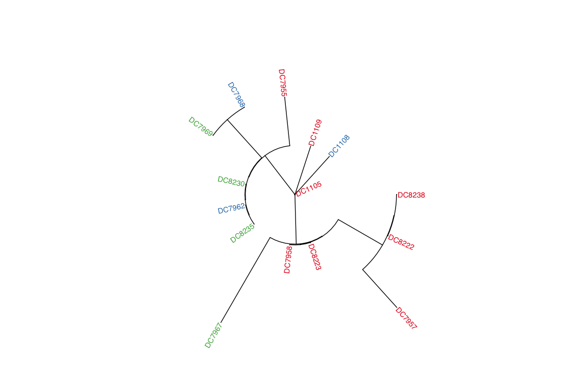

Mitochondrial Haplotypes
================

As a complement to examining mitochondrial haplotype networks we also
performed maximum likelihood tree inference on mitochondrial haplotypes
using iq-tree.

For the host we find that the red lineages almost form a monophyletic
group (with the exception of DC7957) whereas the green and blue lineages
are intermingled within several clades.

<!-- -->

For the symbionts we find that one sample, `DC8229` has a haplotype very
different from the rest, perhaps indicating that its dominant symbiont
is not Cladocopium. We removed this sample in order to visualise
relationships between the other samples. The tree reflects the fact that
many of the red lineage samples had the same haplotype (see TCS network
of haplotypes) and therefore have very short branch lengths in the tree.
The green and blue lineages are also strongly intermingled.

<!-- -->
