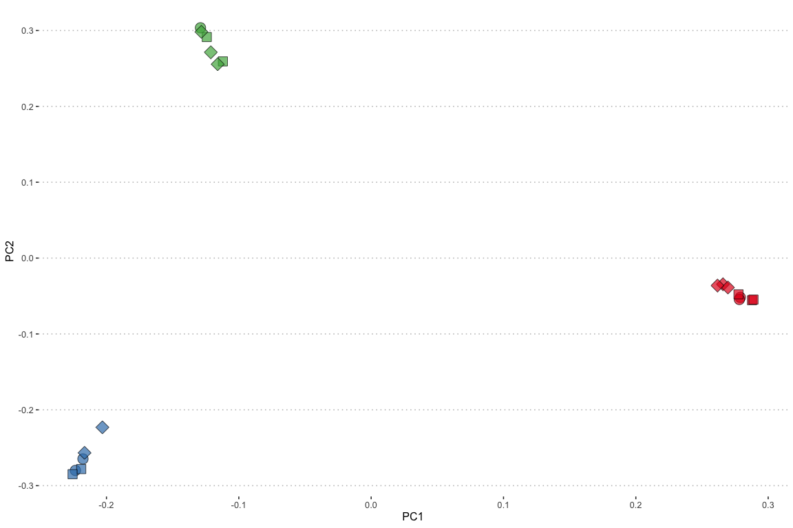
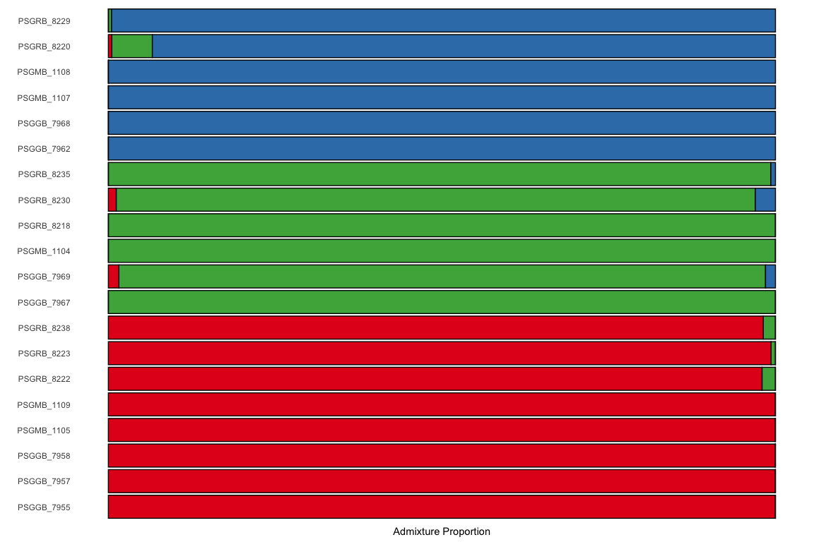

Population Structure
================
Ira Cooke

We used PCAngsd to infer population structure from low whole genome
sequencing data on our 20 *P. speciosa* samples. PCAngsd creates a
sample covariance matrix to allow model-free genetic clustering of
samples. It also calculates the optimal number of clusters and
calculates admixture proportions based on these.

As input data to PCAngsd we used bam files produced by following the
GATK best practices workflow for mapping reads to the host genome, as
well as marking adapters and duplicats. `angsd` was then used to call
variant sites and calculate genotype likelihoods at all of those sites.
See \[hpc/angsd/02\_import\_vcf.sh\] for full details.

Genotype likelihood values were then used as input to `PCAngsd` to
produce a covariance
matrix.

<!-- -->

Admixture proportions are also calculated by PCAngst (based on optimal K
= 3). These can be plotted in the style of a STRUCTURE plot as
follows;

<!-- -->
