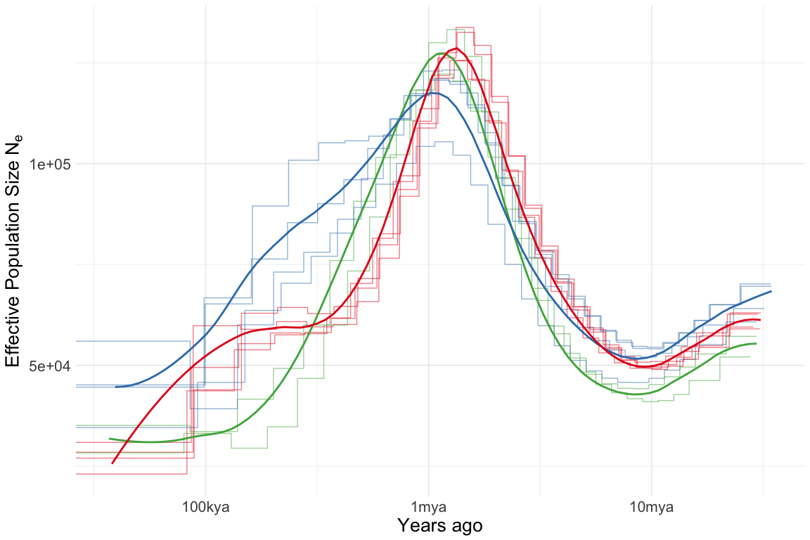

MSMC Analysis
================

We used deep sequencing data for 10 samples to infer demographic history
from the distribution of heterozygous sites using
[msmc2](https://github.com/stschiff/msmc2). Since each sample is
analysed separately the variation in inferred histories between samples
provides a measure of uncertainty. In addition we performed 100
bootstrap replicates for each

Data was therefore prepared for msmc analysis as follows;

  - The genome was masked using the
    [snpable](http://lh3lh3.users.sourceforge.net/snpable.shtml) suite
    of utilities. See [02\_snpable.sh](hpc/msmc/02_snpable.sh) for
    details.
  - Only contigs larger than 1Mb were included
  - A mappability mask was generated using `makeMappabilityMask.py` from
    [msmc-tools](https://github.com/stschiff/msmc-tools)
  - SNPs were called using the `bamCaller` python script. See
    [04\_covered\_sites.sh](hpc/msmc/04_covered_sites.sh) for details
  - Inputs for a single run were generated with the script
    `generate_multihetsep.py` from
    [msmc-tools](https://github.com/stschiff/msmc-tools)
  - Inputs for bootstraps were generated using the script
    `multihetsep_bootstrap.py` from
    [msmc-tools](https://github.com/stschiff/msmc-tools). 100 bootstraps
    were generated by taking 40 random chunks (per chromosome) of size
    500kb and assembling these into 15 “chromosomes”.
  - The [msmc2](https://github.com/stschiff/msmc2) program was run on
    each bootstrap using options appropriate for a single diploid sample
    (see script [07\_bootstrap.sh](hpc/msmc/08_bootstrap.sh))

<!-- -->
