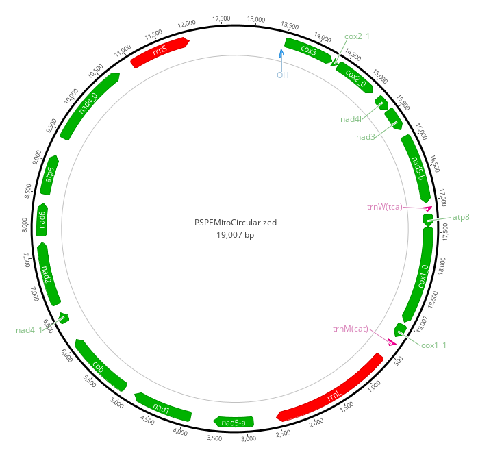

# Host Mitochondrial Genome Assembly

We assembled the P. speciosa mitochondrial genome using data from a single individual `DC1105` in two stages.  

### Stage 1: Abyss Assembly

At the first stage we used `abyss` to assemble all data from `DC1105` (around 20x coverage).  

This generated a highly fragmented host assembly but contained 12 contigs of mitochondrial origin ranging in size from 105bp to 12007bp.  We identified and extracted these contigs by using minimap2 to map all abyss assembled contigs to the Acropora digitifera mitochondrial genome.  Contigs that mapped were extracted and used in the next step.

- See [02_assemble.sh](../abyss/02_assemble.sh) for abyss commands
- See [03_extract_mito.sh](../abyss/03_extract_mito.sh) for commands to identify and extract mitochondrial contigs

### Stage 2: MITObim Assembly

Next we used MITOBim (v1.9) combined with the MIRA assembler to refine the assembly.  The 12 mitochondrial contigs identified in the first step were used as baits to identify reads from the DC1105 dataset of mitochondrial origin.  MITObim works by successively mapping reads to baits, assembling those reads and remapping to the new assembly. After 10 rounds we obtained a single contig of length 19507bp representing the complete mitochondrial genome. 

### Stage 3: Finishing

Lastly we circularised the genome by removing repeated sequences at both ends resulting in a final circularised genome 19007bp.  This circularisation was initially performed manually and later checked using [this script](https://github.com/Kzra/Simple-Circularise) which gave the same result with option -r 10. 

Finally the genome was annotated using [MITOS](http://mitos.bioinf.uni-leipzig.de/index.py)

The mitochondrial genome sequence is available as [nucleotide sequence in fasta format](PSPEMitobim1Circularized.fasta) or in [GenBank format](PSPEMitoCircularized.gb) which includes annotations.

