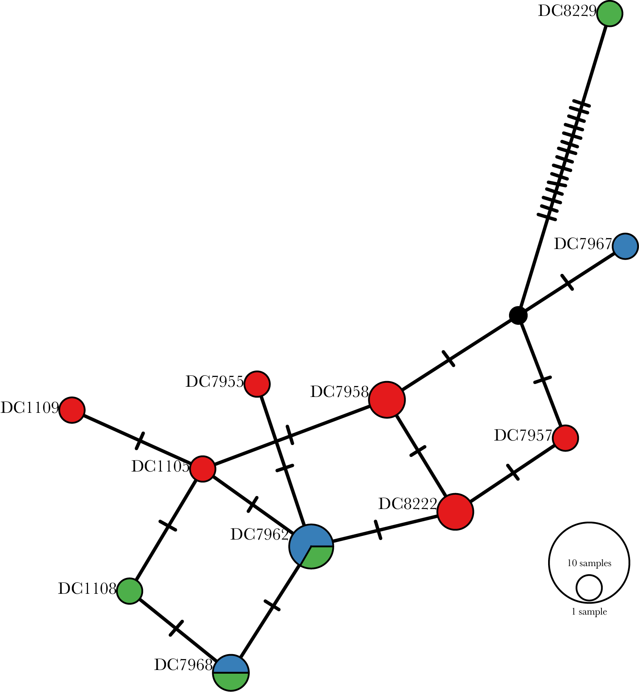

# Symbiont mitochondrial genotyping

As a reference sequence for symbiont mitochondrial genotyping we used the *Cladocopium* (C1) mitochondrial assembly obtained from [reefgenomics.org](http://symbs.reefgenomics.org/download/). 

To call consensus sequences against this reference we used a very similar process to that used for [host mitochondrial genotyping](../mito_mapping/README.md).  The only difference was that prior to mapping reads against the CladeC mitochondrial genome we first extracted all non-host reads (ie reads which were unmapped when aligning to the P. speciosa genome).  Only these non-host reads were used for alignment to the CladeC reference and subsequent consensus haplotype calling.

Read coverage across the Clade C mitogenome showed clear islands of high coverage amid regions of zero or near-zero coverage.  This pattern reflects the difficult of assembling Symbiodinium mitochondrial genomes and indicates that the reference sequence is unlikely to be perfectly accurate. We dealt with this issue by using the following quality control steps. 

1. We removed four samples, `DC1104`, `DC1107`, `DC8218`, and `DC8220` because these had very low overall read coverage.
2. The remaining samples all had an average coverage of at least 4x across the entire mitogenome and a higher value when only well covered regions were considered.

The consensus sequences for the remaining 16 samples were loaded into Geneious.  Stripping ambiguous sites resulted in an alignment of 8404bp with 99.5% identity across samples.

This alignment was used to create a TCS network of haplotypes in PopArt

Finally we used iqtree to select an appropriate evolutionary model and infer a maximum likelihood tree for the sequences.

